<div align="center">

<h3><code>AnshH9094@github ~ $ ./contributions.sh</code></h3>


<br><br>

<h3><code>AnshH9094@github ~ $ whoami</code></h3>
<table border="0">
  <tr>
    <td valign="top" align="center">
      
    </td>
    <td valign="top" align="center">
      
    </td>
  </tr>
</table>

</div>

---

### 🚀 How to Set Up & Deploy This Terminal Profile

#### 1. Create your special GitHub Repository
Create a public repository with your exact GitHub username (e.g. `AnshH9094/AnshH9094`).

#### 2. Local Setup & Generation
```bash
# Install dependencies
pip install -r scripts/requirements.txt

# (Optional) Generate ASCII portrait from your photo
python scripts/prep_photo.py path/to/your-photo.jpg
python scripts/make_ascii_svg.py data/source-prepped.png ascii-portrait.svg

# Generate Neofetch card
python scripts/make_info_card.py

# Fetch contribution data & render heatmap graph
python scripts/fetch_contributions.py AnshH9094 data/contributions.json
python scripts/render_heatmap_svg.py data/contributions.json contrib-heatmap.svg
```

#### 3. Push to GitHub
Commit and push all files to your special repository. GitHub Actions will automatically refresh your contribution heatmap every day at ~06:17 UTC!
